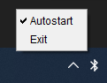

# BT-Tray-App

This is a simple program that allows you to open the Bluetooth settings in Windows 10 by clicking the tray icon, instead
of opening the notification center first, waiting for the animation, and later opening the Bluetooth settings. This is
very convenient if you often connect various Bluetooth devices.

This is a test project and is not intended for everyday use, because Java uses too much RAM for such a simple utility.
